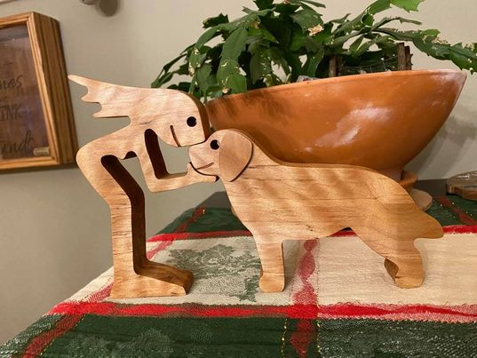

# Female human with big dog

Made this for one for my sister-in-law who is a foster parent for the Warrior Canine Connection project.

I believe that this is cut out of character maple.

Note that all toolpaths are setup in such a way that you cannot inadvertently destroy your machine.  Tweak the feeds and speeds (and cutters) according to your needs.  Also confirm the thickness of your work piece before cutting.
