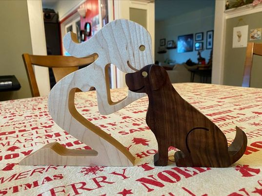

# Female human with young puppy

Made this for a niece who is a foster parent for the Warrior Canine Connection project.

This is cut out of Cambia Maple and Curly Maple.

Note that all toolpaths are setup in such a way that you cannot inadvertently destroy your machine.  Tweak the feeds and speeds (and cutters) according to your needs.  Also confirm the thickness of your work piece before cutting.
