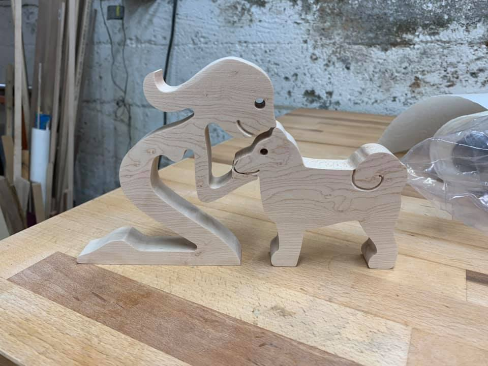

# Female with a Shiba Inu dog

I made this for a former co-worker whose wife has a Shiba Inu.  Tried to get the tail look correct.

Note that all toolpaths are setup in such a way that you cannot inadvertently destroy your machine.  Tweak the feeds and speeds (and cutters) according to your needs.  Also confirm the thickness of your work piece before cutting.
