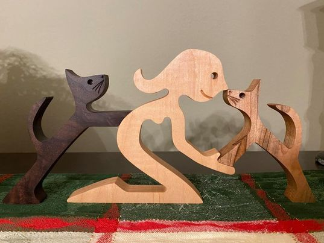

# Human with Two Cats

I've made several variations on this and so far this is one that is most dialed in.

Human is cut out of European Beech and the cat on the right is character maple and the cat on the left is cambia maple.

Note that all toolpaths are setup in such a way that you cannot inadvertently destroy your machine.  Tweak the feeds and speeds (and cutters) according to your needs.  Also confirm the thickness of your work piece before cutting.
