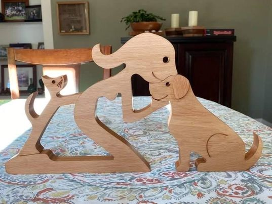

# Female human with a cat and dog

Made this for a friend in California.  

Within the Vectric file there is a layer with an attempt at this that I didn't love. 

Note that all toolpaths are setup in such a way that you cannot inadvertently destroy your machine.  Tweak the feeds and speeds (and cutters) according to your needs.  Also confirm the thickness of your work piece before cutting.
