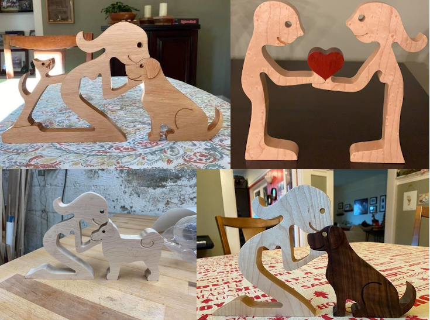
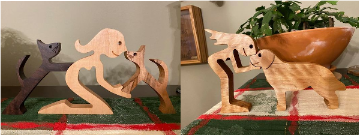

# CNCFigures

This repository includes some CNC Files for simple wooden figures.

Some time ago I noticed advertisements for wooden figures that seemed pretty simple to replicate and an opportunity to make custom gifts for friends and family.  This repository contains those efforts.  

The different types of figures are divided into directories with README files that contain an example of my having cut out the figures and some small amount of notes.  

Most of the time I cut the figures out of 4/4 wood but I've done as thin as 3/4 and as thick as 5/4. 

With all of the Vectric files you should redo the toolpaths according to your machine specifications.  Pay careful attention to the depth of cut that I've specified in the toolpaths that are included here.  They are super shallow in case you forget to modify the toolpaths to your specifications.  Hopefully with the slow speed and shallow cuts you will notice it and redo them according to your specifications.
