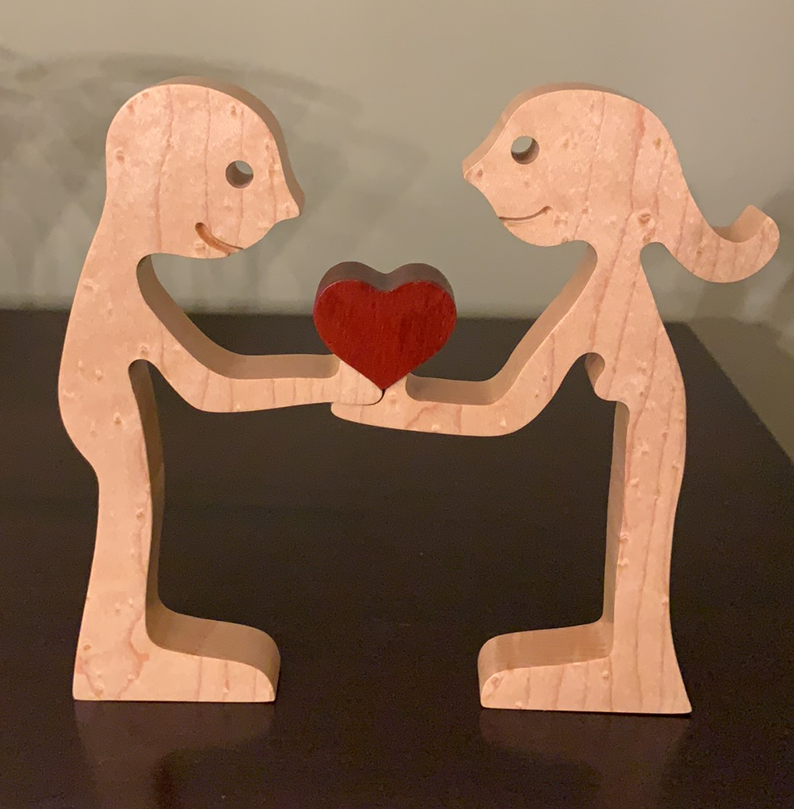

# Two humans and a heart

This one is probably my favorite.  

The two humans are cut out of maple and the heart in the center is bloodwood.  I'm hopeful that the bloodwood red heart retains its red color for awhile. 

I like the female hair on this one.

Note that all toolpaths are setup in such a way that you cannot inadvertently destroy your machine.  Tweak the feeds and speeds (and cutters) according to your needs.  Also confirm the thickness of your work piece before cutting.
